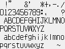

# GBS Tall Text Plugin

GB Studio 4.3.0 engine plugin that renders **16px-tall (8x16) text** using the technique from **Dragon Warrior III (GBC)**: every character is a double-height glyph made of two vertically stacked 8x8 tiles, streamed into VRAM as it is printed.




https://github.com/user-attachments/assets/7ceef128-eb02-4d69-bc6a-6ef856e2f34e


## The Dragon Warrior III technique

Reference disassembly: `dragon-warrior-3-gbc/game/src/text/draw.asm`.

DW3 stores its dialog font as **32 bytes per character** — a top 8x8 tile followed by a bottom 8x8 tile (`TilesetDoubleHeightCharacters`, 22x16 tiles = 176 characters). Three cooperating mechanisms make printing fast:

1. **Pre-paired tilemap.** `DrawTextBoxAndSetupTilesetLoad` fills the text box tilemap with sequential tile indices stepping by 2 per column (`inc a; inc a`): the top row of a text line gets even indices, the map row below gets the following odd indices. First line uses tiles `$FC,$FE..`, second `$20,$22..`.
2. **One copy per character.** With bit 3 of `W_TextConfiguration` set ("is dialog text, double height"), `DrawCharacter` copies `$20` (32) bytes from `character_index * 32` in the font tileset to the current VRAM destination (`W_TextTilesetDst`), then advances the destination by 32. Because the tilemap already pairs tile n (top) with tile n+1 (bottom, one map row down), the character appears fully formed — **no tilemap writes happen while printing**.
3. The text box itself is drawn via WRAM staging + DMA and scrolled with STAT interrupts (DW3-specific polish, not needed here).

## The GB Studio adaptation

In GB Studio the text layer tilemap is dynamic (dialogue windows move, scroll and clear), so instead of pre-tiling the window the plugin:

- allocates **tile pairs** from a reserved VRAM range through an **LRU cache keyed by character** (the proven structure from gbs-HalfWidthTextPlugin — cache entry *i* owns tiles `first_tile + 2i` and `first_tile + 2i + 1`), so repeated characters reuse their pair instead of consuming new tiles;
- on a cache miss uploads both 16-byte halves with `SetBankedBkgData` straight from the font asset's bitmaps;
- writes two tilemap bytes per character: top tile at the cursor, bottom tile one map row below (`+32`);
- treats every text line as **two tilemap rows**: `\n` advances by 64 bytes, `\r` scrolls the text area by two rows (`scroll_rect` twice).

The full control-code set of the stock renderer is supported (speed, font switch, gotoxy, wait-input, palette); `\007` color and `\010` direction are skipped with their parameter.

## Tall font assets (DW3 grid layout)

A tall font is a standard GB Studio font asset (`assets/fonts/name.png`, no `.json` needed):

- **128px wide, 16 characters per row, 8x16 pixel cells**, in ASCII order starting at space (0x20) — visually identical to DW3's own `DoubleHeightCharacters` sheet. Image tile rows therefore alternate 16 top halves / 16 bottom halves.
- **Background must be non-transparent white, RGB(240,240,240)** — pure white counts as transparent and makes the font compiler trim + left-shift glyphs, destroying the layout.
- At most **120 characters (15 tile rows)**; a 96-character ASCII font (128x96px) is the normal case.

The renderer finds both halves of character `ch` arithmetically through the compiler's automatic positional recode table (`table[32 + imageTilePos]`):

```
n   = ch - 32
top    = recode_table[32 + ((n & 0xF0) << 1) + (n & 0x0F)]
bottom = recode_table[same + 16]
```

Because the table values index the *deduplicated* unique-tile list, tile deduplication (blank halves, identical halves) is resolved for free — no dedup-aware `.json` table has to be generated.

`tools/extract_dw3_font.js` regenerates `font/dw3-tall.png` from the DW3 disassembly's font sheet (character indices from `scripts/res/tilesets/en.lst`: `0-9`=0x00, `A-Z`=0x0A, `a-z`=0x24, punctuation at 0x92+). 76 ASCII characters have DW3 glyphs; the rest are blank.

## Events

| Event | Native | Notes |
|---|---|---|
| Tall Text: Display Dialogue | `ttx_display_dialogue` | stock-style dialogue window; every line is 2 tiles tall (defaults: min height 6, max 8, scroll height 4 = two visible lines) |
| Tall Text: Draw To Background | `ttx_display_text` | instant draw to the background layer |
| Tall Text: Draw To Overlay | `ttx_display_text` | instant draw to the overlay/window layer |
| Tall Text: Draw At Text Speed | `ttx_display_text_speed` | modal typewriter on either layer |
| Tall Text: Reset Tile Cache | `ttx_reset_cache` | call in every scene's On Init |
| Tall Text: Set Tile Range | `ttx_set_tile_range` | change the reserved VRAM tile range at runtime |

## Usage rules

- **Set Font to a tall font before drawing** — the plugin reads the *current* font (stock "Set Font" event or `\002` in-text switches, which also reset the cache).
- **Call "Tall Text: Reset Tile Cache" in every scene's On Init** — scene loads overwrite VRAM and there is no plugin hook for scene loads.
- Engine fields `ttx_first_tile` / `ttx_last_tile` (defaults **112-191** = 80 tiles = 40 cached characters) set the reserved background tile range. It must not collide with scene background tiles (0 upward) or stock UI/dialogue tiles (192-255). A full two-line dialogue can show up to 36 distinct characters at once, so keep at least ~72 tiles reserved; the cache uses at most 2 × `TTX_CACHE_MAX` tiles.
- Engine field `TTX_CACHE_MAX` (default **64**, range 4–128) caps how many characters the LRU cache can track. It is a compile-time define: each entry costs 3 bytes of WRAM, so lowering it reclaims WRAM; raising it only helps together with a larger reserved tile range (usable entries = min(`TTX_CACHE_MAX`, range/2)).
- Text coordinates are in tiles; a line of tall text occupies two tile rows. 18 characters fit per framed dialogue line.
- Avatars and `\007` text color are not supported.

## Repo layout

```
src/TallTextPlugin/          the plugin (copy into your project's plugins/ folder)
font/dw3-tall.png            ready-made tall font extracted from DW3
tools/extract_dw3_font.js    regenerates the font from the DW3 disassembly
tallTextPluginExample/       buildable example project (background draw,
                             typewriter, scrolling dialogue)
```

The example was verified building to ROM with gb-studio-cli 4.3.0 (`build/rom/tall_text_demo.gb`).

> ⚠️ The example project's `plugins/TallTextPlugin` is a **copy** of `src/TallTextPlugin` — re-copy after editing the source, or the example silently builds the old code.

## Memory Footprint

Measured against the stock GB Studio **4.3.0-e1** engine (per-file SDCC compile with GB Studio's build flags, default engine settings). Values are the plugin's *delta* versus the stock engine; DMG build, with CGB noted where it differs. ROM cost lands in banked ROM (GB Studio's autobanker spreads it across switchable banks); using the plugin's events additionally compiles a few bytes of GBVM script per call into your project's script banks.

| | Cost |
|---|---|
| WRAM | +211 bytes |
| ROM | +2,128 bytes (DMG) / +2,309 bytes (CGB) |

- **WRAM:** 211 bytes — the tile-pair LRU cache arrays (3 × 64 = 192 bytes) plus renderer/engine-field state in `tall_text.c`. Scales with the `TTX_CACHE_MAX` engine field at 3 bytes per entry (default 64 entries; e.g. 32 entries saves 96 bytes).
- **ROM:** the figure above is the renderer code only — the tall font asset you add to the project compiles its own data on top (~2 KB for the 96-char DW3 font after tile dedup).
- **Engine WRAM headroom:** the stock GB Studio 4.3.0 engine leaves about **854 bytes** of WRAM free (usable engine WRAM is 7,776 bytes at 0xC0A0–0xDF00; the stock engine uses 6,922 bytes). With this plugin installed roughly **643 bytes** remain. This figure does not depend on how many global variables your project defines: the script memory array has a fixed size of VM_HEAP_SIZE + (VM_MAX_CONTEXTS × VM_CONTEXT_STACK_SIZE) words — 768 + 16 × 64 = 1,792 words (3,584 bytes) with stock engine settings.
- **SRAM:** not used.
