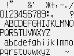

# gbs-TallTextPlugin

**Version 4.3.1 — Requires GB Studio ≥ 4.3.0**

A GB Studio engine plugin that renders **16px-tall (8×16) text** using the technique from *Dragon Warrior III* (GBC): every character is a double-height glyph made of two vertically stacked 8×8 tiles, streamed into VRAM as it is printed.

https://github.com/user-attachments/assets/7ceef128-eb02-4d69-bc6a-6ef856e2f34e

---

## Table of Contents

1. [Concepts](#concepts)
2. [Project Setup](#project-setup)
3. [Engine Settings](#engine-settings)
4. [Size Limits and Restrictions](#size-limits-and-restrictions)
5. [Events Reference](#events-reference)
6. [Media](#media)
7. [Memory Footprint](#memory-footprint)

---

## Concepts

### Double-height characters

Each character is two 8×8 tiles stacked vertically, so a line of tall text occupies **two tilemap rows**. `\n` moves down a full two-row line; `\r` scrolls the text area by two rows.

### The character tile cache

Tall glyphs are uploaded to a reserved range of VRAM tiles as they are printed, and kept in a **cache keyed by character** — each cache entry owns one tile pair. Repeated characters reuse their pair instead of consuming new tiles; when the range is full, the least recently used character's pair is evicted.

The cache can be turned off entirely with the **Enable character tile cache** engine setting. Its bookkeeping is then compiled out — 195 bytes of WRAM and 348 bytes of ROM come back — and each character is rendered into the next tile pair of the reserved range, cycling round-robin. Repeated characters no longer share a pair, so the range has to be big enough for every character on screen at once (two tiles each).

### The reserved tile range

The plugin needs a block of background tile indices it can own. Scene background tilesets occupy tiles from 0 upward and GB Studio's UI/dialogue tiles occupy 192–255, so the default reserved range is **112–191** (80 tiles = 40 cached characters). A full two-line dialogue can show up to 36 distinct characters at once, so keep at least ~72 tiles reserved.

### Tile placement on Game Boy Color

On CGB, each tilemap cell can read its tile data from either VRAM bank, and the plugin sets that per character cell:

- **Bank 0 only** — the default, and the only mode on DMG hardware.
- **Bank 1 only (Color)** — every glyph pair lives in bank 1, so the reserved indices stop competing with bank-0 scene tiles entirely.
- **Alternate bank 0/1 (Color)** — entries are spread across both banks, doubling the characters the range can hold.

The two Color modes are meant for Color Only projects, and also work in mixed color modes on GBC hardware. On DMG the plugin falls back to bank 0 automatically. In Color Only mode your scene backgrounds may themselves use bank-1 tiles, so pick a range whose bank-1 indices are free too.

---

## Project Setup

### 1. Install the plugin and the font

Copy `src/TallTextPlugin` into your project's `plugins/` folder, and `font/dw3-tall.png` into `assets/fonts/`. That is a ready-made tall font extracted from Dragon Warrior III; you can also make your own (see below).

### 2. Set the font before drawing

The plugin renders glyphs from the **current** font, so use the stock **Set Font** event (or a `\002` in-text switch) to select the tall font before any tall-text draw.

### 3. Reset the cache in every scene

Add **Tall Text: Reset Tile Cache** to each scene's **On Init**. Loading a scene overwrites VRAM, and there is no automatic hook for scene loads.

### 4. Draw

Use the draw events for instant text, typed-out text, or a full dialogue box.

### Making a tall font

A tall font is a standard GB Studio font asset (`assets/fonts/name.png`, no `.json` needed):

- **128px wide, 16 characters per row, 8×16 pixel cells**, in ASCII order starting at space (0x20).
- **A non-transparent white background, RGB (240,240,240)** — pure white counts as transparent and makes the font compiler trim and left-shift the glyphs, destroying the layout.
- At most **120 characters** (15 tile rows); a 96-character ASCII font at 128×96px is the normal case.

`tools/extract_dw3_font.js` regenerates `font/dw3-tall.png` from the Dragon Warrior III disassembly's font sheet. 76 ASCII characters have DW3 glyphs; the rest are blank.

---

## Engine Settings

Found under **Settings → Tall Text**.

| Setting | Default | Description |
|---|---|---|
| **First VRAM tile reserved for tall text** | 112 | First background tile index reserved for glyph pairs. |
| **Last VRAM tile reserved for tall text** | 191 | Last reserved tile index, inclusive. |
| **Tile placement (VRAM bank)** | Bank 0 only | Which VRAM tile data bank glyph pairs are uploaded to: Bank 0 only, Bank 1 only (Color), or Alternate bank 0/1 (Color). |
| **Enable character tile cache** | On | Keeps rendered tile pairs in an LRU cache so repeated characters reuse their pair. Turn it off to compile the cache out (−195 B WRAM, −348 B ROM) and render every character into the next reserved tile pair round-robin. |
| **Character cache capacity (entries)** | 64 | How many characters the cache can track, 4–128. Each entry costs 3 bytes of WRAM, so lowering it reclaims WRAM. Raising it only helps together with a larger reserved tile range. Ignored when the cache is off. |
| **Replace stock text rendering** | Off | Compiles GB Studio's own text renderer out and points the stock *Display Dialogue*, *Display Text* and *Menu* events at this plugin instead. Frees 1,629 B of ROM (1,965 B in Color mode) and tiles 204–255. See below. |
| **Menu cursor row** | Lower tile of the line | Which tile of a two-row menu line the cursor sits on. Lower is level with the baseline, upper reads as slightly raised. |

Usable cache entries are `min(cache capacity, range size / 2)` — or `min(cache capacity, range size)` with *Alternate bank 0/1*. With the cache disabled the capacity setting drops out and the whole reserved range is used.

---

## Size Limits and Restrictions

- **The reserved range must not collide** with your scene background tiles (0 upward) or GB Studio's UI/dialogue tiles (192–255). The cache uses at most 2 × the cache capacity in tiles.
- **The cache can overflow.** When it is full, the least recently used character's pair is reused, so text drawn long ago can visually corrupt if it is still on screen while a lot of new text is drawn.
- **Reset the cache on every scene load** — there is no automatic hook for it. *Reset Tile Cache* also rewinds the round-robin cursor when the cache is disabled, so keep calling it either way.
- **Switching fonts resets the cache** (via the Set Font event or a `\002` in-text switch). With the cache disabled there is nothing to invalidate, so a font switch costs nothing.
- **With the cache disabled, every character is re-uploaded on every use** — two 16-byte VRAM tile copies per character, where a cache hit was two tilemap writes. It is a WRAM/ROM trade, not a speed one.
- Text coordinates are in tiles, and each line of tall text occupies **two** tile rows. **18 characters** fit per framed dialogue line; a dialogue defaults to min height 6, max height 8, scroll height 4 — two visible lines.
- **Avatars and the `\007` text colour code are not supported.** The full control-code set of the stock renderer is otherwise handled (speed, font switch, gotoxy, wait-for-input, palette); `\010` direction is skipped.
- Compatible variants are included for use alongside **ContinuousScenePlugin** and **ScreenScrollPlugin**, and are selected automatically.

---

### Replacing the stock text renderer

GB Studio's own renderer normally sits in the ROM alongside this plugin's, even in a
project where every visible string is drawn by the plugin. **Replace stock text
rendering** removes it.

With the setting on, the plugin ships a copy of the engine's `ui.c` whose text renderer
is compiled out, and supplies `ui_draw_text_buffer_char` itself. Nothing calls the
plugin explicitly — the stock engine's own `ui_update()` resolves to it, so everything
that used to draw stock text now draws tall text:

| | |
|---|---|
| **Display Dialogue**, **Display Text** | render in tall text, without swapping in this plugin's events |
| **Menu** | renders in this plugin's text, with the cursor rows corrected — see below |

Two things you get back:

- **1,629 bytes of ROM** (**1,965** in a Color build), measured on the module, minus 8
  bytes for the forwarder. Plus 5 bytes of WRAM.
- **Tiles 204–255.** They were the stock renderer's scratch buffer, and the usual advice
  is to keep clear of them unless nothing on screen uses stock text. With the stock
  renderer gone there is nothing left to collide with, so those 52 tiles can go straight
  into the reserved range.

**Menus work with or without the setting.** Two things are wrong with the stock Menu
event once lines are two rows tall: its cursor steps one 8px row per option, falling a
row further behind each time, and its window is sized at compile time for stock rows so
the frame comes out half as tall as the text in it.

The driver lives in this plugin as **`<prefix>_ui_run_menu`**, a copy of the stock one
with the cursor stride as a parameter. Option *n* occupies rows `(n-1)*stride + 1` through
`+ stride`, and which of them the cursor takes is the
**Menu cursor row** setting: the lower tile sits level with the baseline, the upper one
reads as slightly raised, and which suits depends on where your font puts its glyphs in
the cell. At stride 1 there is only one row and both choices are the stock position. It is always compiled, under its own name, so:

| | Menu driver used |
|---|---|
| this plugin’s **Menu** event | calls `<prefix>_ui_run_menu` directly, through a native |
| stock **Menu** event, setting off | stock `ui_run_menu`, unchanged and still correct for stock text |
| stock **Menu** event, setting on | `ui_run_menu` is rewired to `<prefix>_ui_run_menu` |

The event calls the native rather than emitting `VM_CHOICE`, because that instruction
always calls `ui_run_menu` — which is only this plugin’s when the setting is on. Going
direct is what lets the event work either way. It also means no `.MENUITEM` table is
emitted: the options are a single column, so the driver lays them out itself.

With the setting off, the bundled `ui.c` is the engine's own file byte for byte, so it
costs nothing and changes nothing. It does mean this plugin now overrides `ui.c`, so it
cannot be combined with another plugin that overrides the same file unless one of them
ships an `engineAlt` variant for the other — the ContinuousScene and ScreenScroll
variants shipped here already do.

## Events Reference

All events appear under the **Tall Text** group in the script editor.

| Event | Description |
|---|---|
| **Tall Text: Display Dialogue** | A stock-style dialogue window where every line is two tiles tall. |
| **Tall Text: Draw To Background** | Instantly draws text at an X/Y tile position on the background layer. |
| **Tall Text: Draw To Overlay** | The same, on the overlay (window) layer. |
| **Tall Text: Draw At Text Speed** | Types the text out at the current text speed on either layer. Blocks until done. |
| **Tall Text: Reset Tile Cache** | Forgets all cached glyph pairs. Call this in each scene's On Init. |
| **Tall Text: Set Tile Range** | Changes the reserved VRAM tile range and tile placement at runtime. |
| **Tall Text: Menu** | A menu sized and stepped for two-row lines, drawn with this plugin. Works with or without *Replace stock text rendering*. |

---

## Media

Both examples end with a **menu** built from the plugin’s own Menu event — a window
sized for two-row lines, a cursor that steps to match, and the chosen option left in the
`Item_Id` variable (zero if B cancelled it).

Two example projects are included:

- `tallTextPluginExample/` — background draw, typewriter and a scrolling dialogue, in mono mode.
- `tallTextPluginColorExample/` — a Color Only build demonstrating tile placement: *Bank 1 only*, then *Alternate bank 0/1* via the Set Tile Range event.

---

<!-- SETTINGCOST:BEGIN -->
### What each engine setting costs

Every setting here changes what gets compiled. Figures are what you **get back by
turning the setting off**; rows marked *off by default* show what turning it **on**
costs instead, and sliders show the cost per step. A dash means that budget does not
move.

| Setting | Bank 0 | WRAM | Banked ROM |
|---|---|---|---|
| Enable character tile cache | — | 195 B | 348 B |
| Character cache capacity (entries) *(slider 4–128, default 64)* | — | 3 B/step | — |

- **Enable character tile cache**: measured from two full ROM builds of `tallTextPluginExample` at the default 64-entry capacity (link map `_DATA`+`_INITIALIZED` and `_CODE_n` totals). Turning it off also removes the capacity slider's cost, since the LRU tables are what that slider sizes.
- **Character cache capacity (entries)**: going from 4 to 128 moves WRAM by +372 B.

How these were measured

GB Studio 4.3.0-e1. This plugin's `engine/src/**/*.c` was compiled with the
toolchain and flags GB Studio itself uses (`lcc -msm83:gb -Wf--max-allocs-per-node 3000
-DHUGE_TRACKER -DRUMBLE_ENABLE=0x08u`) against a merged include tree, and the SDCC object
files' area records were read: `_HOME` is bank 0, `_DATA`/`_INITIALIZED`/`_BSS` are WRAM,
and `_CODE*`/`_CONST`/`_LIT`/`_INITIALIZER` are banked ROM.

Two caveats. Only this plugin's own engine sources are measured, so a setting that also
changes a struct shared with stock engine files can move a few more bytes in files the
plugin does not ship. And each setting is toggled on its own: a handful measure slightly
*negative* because enabling their code lets the compiler drop a fallback path elsewhere,
and settings that gate other settings only show their own contribution.

<!-- SETTINGCOST:END -->

## Memory Footprint

Measured against the stock GB Studio **4.3.0-e1** engine (per-file SDCC compile with GB Studio's build flags, default engine settings). Values are the plugin's *delta* versus the stock engine; DMG build, with CGB noted where it differs. ROM cost lands in banked ROM (GB Studio's autobanker spreads it across switchable banks); using the plugin's events additionally compiles a few bytes of GBVM script per call into your project's script banks.

| | Cost |
|---|---|
| WRAM | +211 bytes |
| ROM | +2,128 bytes (DMG) / +2,309 bytes (CGB) |

- **WRAM:** 211 bytes — the tile-pair cache arrays (3 × 64 = 192 bytes) plus renderer and engine-field state. Scales with the **Character cache capacity** engine setting at 3 bytes per entry (default 64 entries; e.g. 32 entries saves 96 bytes), and drops by 195 bytes when **Enable character tile cache** is turned off.
- **ROM:** the figure above is the renderer code only — the tall font asset you add to the project compiles its own data on top (~2 KB for the 96-character DW3 font after tile deduplication).
- **Engine WRAM headroom:** the stock GB Studio 4.3.0 engine leaves about **854 bytes** of WRAM free (usable engine WRAM is 7,776 bytes at 0xC0A0–0xDF00; the stock engine uses 6,922 bytes). With this plugin installed roughly **643 bytes** remain. This figure does not depend on how many global variables your project defines: the script memory array has a fixed size of VM_HEAP_SIZE + (VM_MAX_CONTEXTS × VM_CONTEXT_STACK_SIZE) words — 768 + 16 × 64 = 1,792 words (3,584 bytes) with stock engine settings.
- **SRAM:** not used.

---

<!-- BANK0:BEGIN -->
## Bank 0 (HOME) Usage

Bank 0 is the 16 KB non-switchable ROM bank that the GB Studio engine core,
the interrupt handlers and the GBDK runtime all share. Banked ROM is cheap
(add another bank), bank 0 is not, so it is usually the first thing a project
runs out of.

| | Bytes |
|---|---|
| Bank 0 used by this plugin | **0** |
| Bank 0 free with this plugin installed | **1,451** of 16,384 (91% used) |

**This plugin costs nothing in bank 0.** All of its code lives in a switchable
ROM bank; nothing it adds is resident in bank 0.

How this was measured

GB Studio 4.3.2, DMG target, default engine settings. Each module's bank 0
contribution is the `A _HOME size` record that SDCC writes into its `.rel`
object, summed over the engine sources this plugin provides. Stock sizes come
from building projects whose only plugin ships no engine C, so every module in
them is the untouched engine; two such builds were compared and agreed on all
73 shared modules.

The "free" figure is a stock project with this plugin and nothing else. Your
own number will differ: other plugins, and any engine settings that change what
the core compiles, move it independently of this plugin.

<!-- BANK0:END -->
